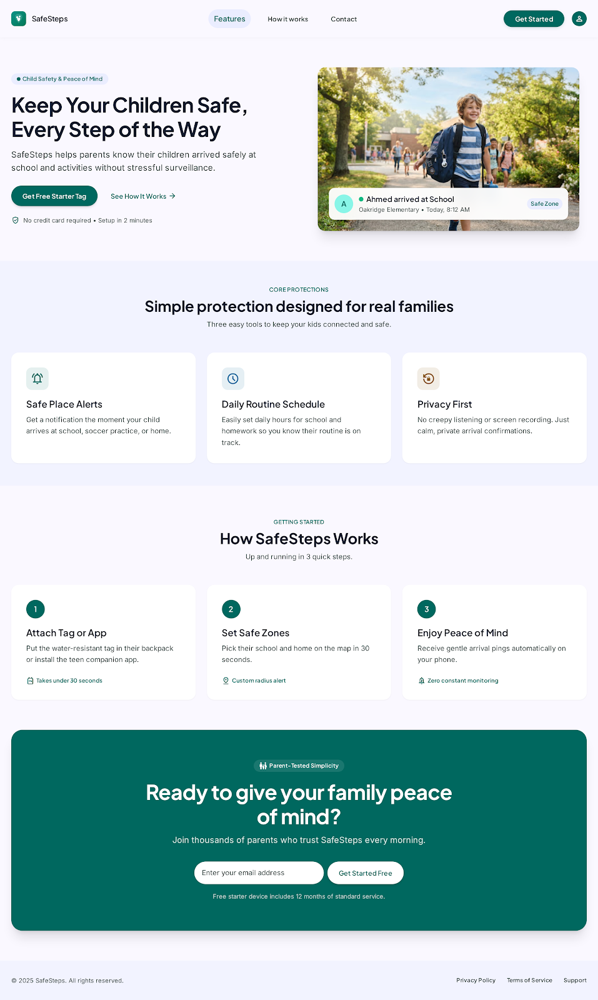

# Ans for Second Task

## Idea of Our Project

The design for the home page we made for the project is about an app for mothers. The idea is to help mothers track their children using their phones and AirTags. The mother can also see a summary of the child's phone activity.

The app also has a time management feature for important things such as medical appointments, vaccines, and other medical needs.

 

 

## Photo of Our Design

 

## Video Proof

This shows that I completed the second task and finished all levels of CSS Diner.

